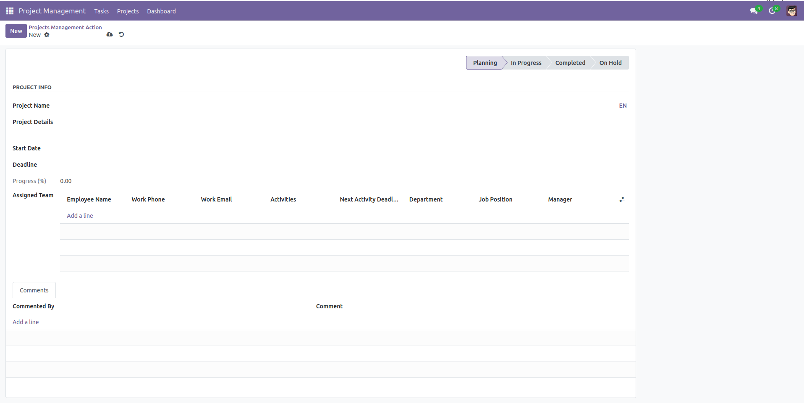
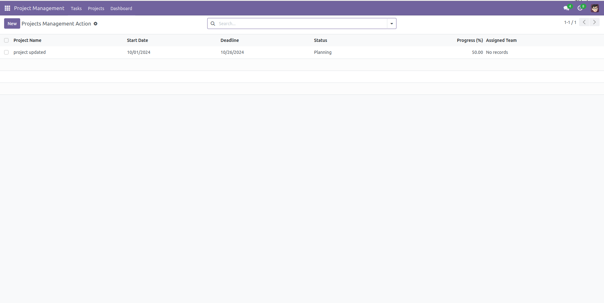
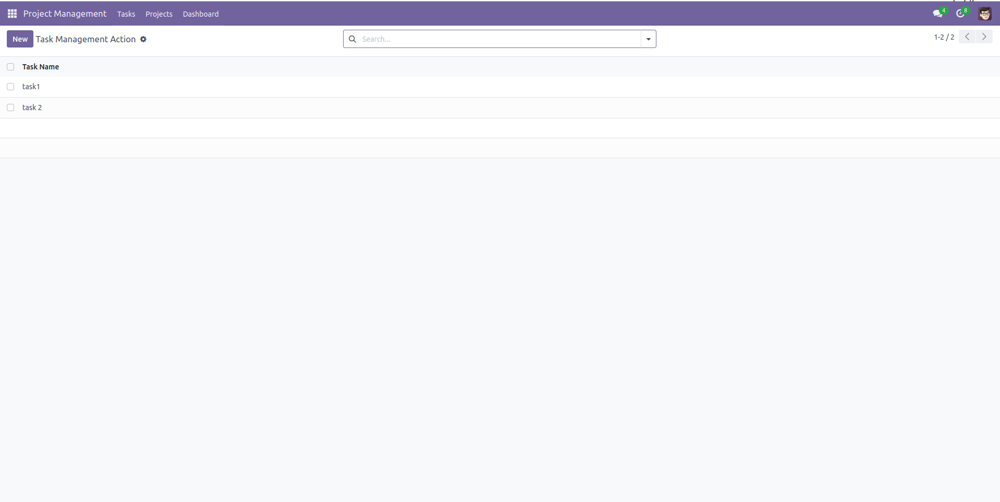
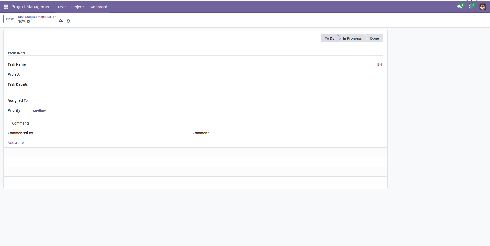
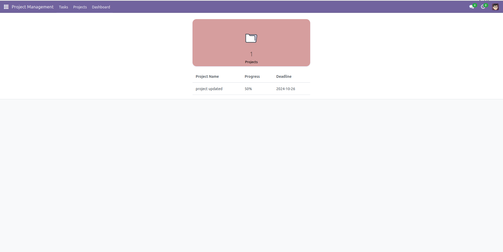

# Project Management 

Welcome to the **Project Management** repository! This project is a ERP application, developed using Odoo and postgress.   

## Features  
- A customizable Odoo module that enhances project and task management by offering streamlined tools
for organizing tasks, tracking project timelines, and optimizing team collaboration.

- Role-based access for Admins, Project Managers, and Team Members to enhance workflow efficiency.

- Implemented a progress tracking feature for tasks and a dashboard summarizing project progress.

- Designed a report view summarizing project performance, with options to export reports in PDF and Excel formats.

- Enabled multilingual support for English and Arabic.

- Developed a comment feature for projects and tasks, allowing team members to discuss progress and share updates.